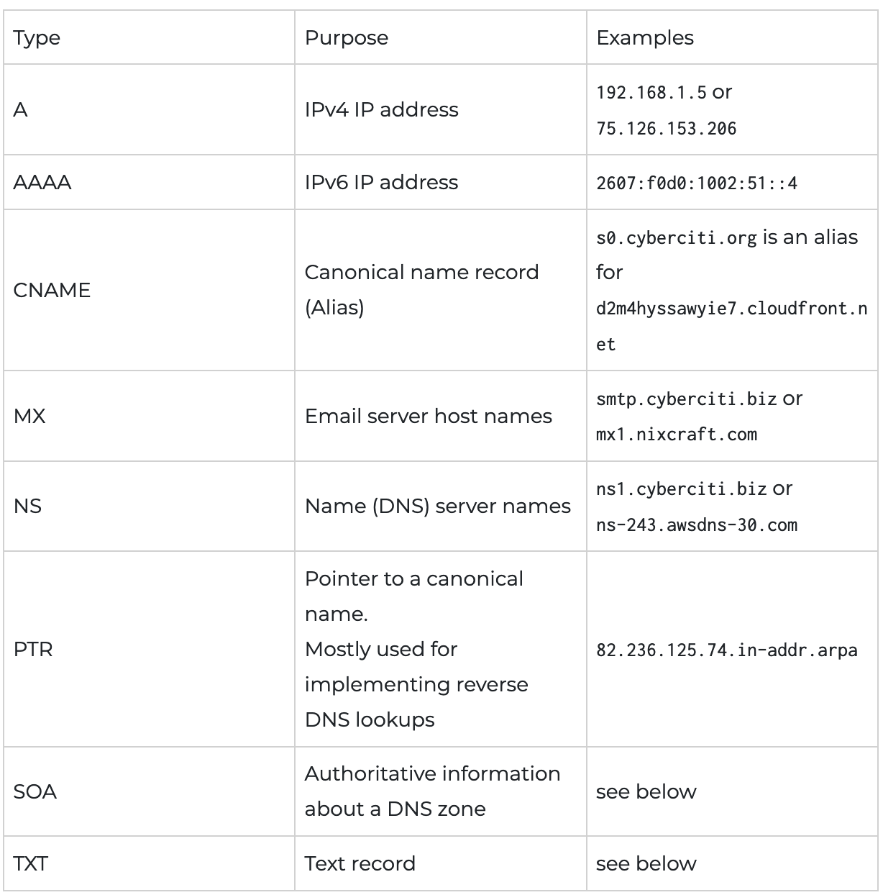

# P2

## 1
DNS guarda información sobre dominios. De cada dominio se guarda información en registros.

Tipos de registros:
- A. relación nombre-IP
- CNAME. nombres o alias de la máquina
- MX servidor de correo
- NS nombres asociados.
- LOC. localización geográfica.



### Conocer la ip de un dominio
```
host -a www.telefonica.com
> El preimero de ANSWER SECTION
> 194.224.110.41
```
> resolveip tambien vale

### Conocer el servidor de correo de un dominio
```
host -t mx telefonica.com
```

## 2

**whois**: preguntas respuestas consultar bbdd sobre información de:
- Propietarios de dominios
- rangos de direcciones IP
- dominios autónomos.


## 3

**traceroute**: ruta que siguen los paquetes de un host a otro.

Necesario que el destino sea un servidor DNS o un servidor web, para conseguir acceder a puntos internos.
traceroute -p 53
traceroute -p 80

Punto de intercambio de españa no devuelve el ICMP